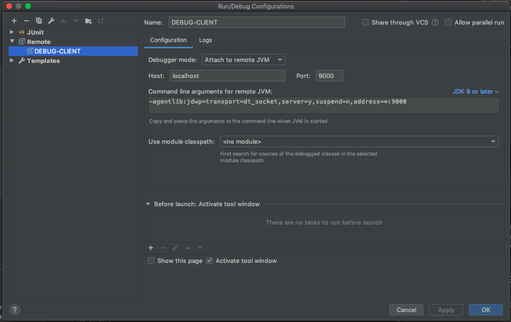

# HiveMQ Test Container

Automatic starting HiveMQ docker containers for JUnit4 and JUnit5 tests.
This enables testing MQTT client applications and integration testing of custom HiveMQ extensions. 

- Community forum: https://community.hivemq.com/
- HiveMQ website: https://www.hivemq.com/
- MQTT resources:
  - [MQTT Essentials](https://www.hivemq.com/mqtt-essentials/)
  - [MQTT 5 Essentials](https://www.hivemq.com/mqtt-5/)

## Features
- [load user defined HiveMQ images and tags](#add-to-your-project)
- [test your MQTT 3 and MQTT 5 client applications](#test-your-mqtt-3-and-mqtt-5-client-application)
- [add a custom hivemq config](#add-a-custom-hivemq-configuration)
- [load an extension from a folder](#load-an-extension-from-a-folder)
- [load an extension directly from your code](#load-an-extension-directly-from-code)
- [set logging level](#set-logging-level)
- [debug a directly loaded extension that is running inside the container](#debug-directly-loaded-extensions)
- [put files into the container](#put-files-into-the-container)
    - [put files into hivemq home](#put-a-file-into-hivemq-home)
    - [put files into extension home](#put-files-into-extension-home)
    - [put license files into the license folder](#put-license-files-into-the-container)
    
## Add to your project

Acquire your GitHub [ACCESS_TOKEN](https://help.github.com/en/packages/publishing-and-managing-packages/about-github-packages#about-tokens) and add it to your `~/.m2/settings.xml`:

    <?xml version="1.0" encoding="UTF-8" standalone="no"?>
    <settings>
        <servers>
            <server>
                <id>github</id>
                <username>GITHUB_USERNAME</username>
                <password>GITHUB_TOKEN</password>
            </server>
        </servers>
    </settings>
    
Add this repository to your `pom.xml`:

    <repositories>
        <repository>
            <id>github</id>
            <url>https://maven.pkg.github.com/hivemq/hivemq-testcontainer</url>
        </repository>
    </repositories>

### Maven + JUnit 4

add these dependencies to your `pom.xml`:

    <dependency>
        <groupId>com.hivemq</groupId>
        <artifactId>hivemq-hivemq-extension-sdk</artifactId>
        <version>4.3.0</version>
    </dependency>
    <dependency>
        <groupId>com.hivemq</groupId>
        <artifactId>hivemq-testcontainer-junit4</artifactId>
        <version>1.0-SNAPSHOT</version>
        <scope>test</scope>
    </dependency>
    <dependency>
        <groupId>junit</groupId>
        <artifactId>junit</artifactId>
        <version>4.13</version>
        <scope>test</scope>
    </dependency>

### Maven + JUnit 5

add these dependencies to your `pom.xml`:

    <dependency>
        <groupId>com.hivemq</groupId>
        <artifactId>hivemq-extension-sdk</artifactId>
        <version>4.3.0</version>
    </dependency>
    <dependency>
        <groupId>com.hivemq</groupId>
        <artifactId>testcontainer-junit5</artifactId>
        <version>1.0-SNAPSHOT</version>
        <scope>test</scope>
    </dependency>
    <dependency>
        <groupId>org.junit.jupiter</groupId>
        <artifactId>junit-jupiter-engine</artifactId>
        <version>5.6.1</version>
        <scope>test</scope>
    </dependency>
    <dependency>
        <groupId>org.junit.jupiter</groupId>
        <artifactId>junit-jupiter-api</artifactId>
        <version>5.6.1</version>
        <scope>test</scope>
    </dependency>
    
## User defined HiveMQ image and tag

Per default the 'hivemq/hivemq4' image and the 'latest' tags are used.
You can define a custom image and tag in the constructor:

### JUnit 4

    @Rule
    final public @NotNull HiveMQEnterpriseTestContainerRule rule 
        = new HiveMQEnterpriseTestContainerRule("hivemq/hivemq-ce", "2020.2");

### JUnit 5

    @RegisterExtension
    final public @NotNull HiveMQEnterpriseTestContainerExtension extension 
        = new HiveMQEnterpriseTestContainerExtension("hivemq/hivemq-ce", "2020.2");

## Test your MQTT 3 and MQTT 5 client application

### JUnit 4

    @Rule
    final public @NotNull HiveMQTestContainerRule rule = new HiveMQTestContainerRule();

    @Test
    public void test_mqtt() {
        final Mqtt5BlockingClient client = Mqtt5Client.builder()
            .serverPort(rule.getMqttPort())
            .buildBlocking();

        client.connect();
        client.disconnect();
    }

### JUnit 5

    @RegisterExtension
    final public @NotNull HiveMQTestContainerExtension extension = new HiveMQTestContainerExtension();

    @Test
    public void test_mqtt() {
        final Mqtt5BlockingClient client = Mqtt5Client.builder()
            .serverPort(extension.getMqttPort())
            .buildBlocking();

        client.connect();
        client.disconnect();
    }
    
## Add a custom HiveMQ configuration

### JUnit 4

    @Rule
    final @NotNull HiveMQTestContainerRule rule = 
        new HiveMQTestContainerRule("hivemq/hivemq4", "latest")
            .withHiveMQConfig(new File("src/test/resources/config.xml"));

### JUnit 5

    @RegisterExtension
    final @NotNull HiveMQTestContainerExtension extension = 
        new HiveMQTestContainerExtension("hivemq/hivemq4", "latest")
            .withHiveMQConfig(new File("src/test/resources/config.xml"));

## Load an extension from a folder

You can load an extension from an extension directory into the container.
The extension will be placed in the container before startup. 

### JUnit 4

    @Rule
    public final @NotNull HiveMQTestContainerRule rule =
            new HiveMQTestContainerRule()
                .withExtension(new File("src/test/resources/modifier-extension"));

### JUnit 5

    @RegisterExtension
    public final @NotNull HiveMQTestContainerExtension extension =
            new HiveMQTestContainerExtension()
                .withExtension(new File("src/test/resources/modifier-extension"));
                
 
## Load an extension directly from code

You can load an extension directly from code, by providing the extension's main class and extension information.
The extension will be packaged properly und put into the container before startup. 

### JUnit 4

    @Rule
    public final @NotNull HiveMQTestContainerRule rule =
        new HiveMQTestContainerRule()
            .withExtension(
                "extension-1",
                "my-extension",
                "1.0",
                100,
                1000,
                MyExtension.class);

### JUnit 5

    @RegisterExtension
    public final @NotNull HiveMQTestContainerExtension extension =
            new HiveMQTestContainerExtension()
                .withExtension(
                    "extension-1",
                    "my-extension",
                    "1.0",
                    100,
                    1000,
                    MyExtension.class);
                    
## Set logging level

You can set the logging level of the HiveMQ instance running inside the container.

### JUnit 4

    @Rule
    public final @NotNull HiveMQTestContainerRule rule =
        new HiveMQTestContainerRule()
            .withLogLevel(Level.DEBUG);

### JUnit 5

    @RegisterExtension
    public final @NotNull HiveMQTestContainerExtension extension =
        new HiveMQTestContainerExtension()
            .withLogLevel(Level.DEBUG);

## Debug directly loaded extensions

You can debug extensions that are directly loaded from your code.

- put a break point in your extension

- enable remote debugging on your container

### JUnit 4

    @Rule
    public final @NotNull HiveMQTestContainerRule rule =
        new HiveMQTestContainerRule()
        .withDebugging(9000);

### JUnit 5

    @RegisterExtension
    public final @NotNull HiveMQTestContainerExtension extension =
        new HiveMQTestContainerExtension()
        .withDebugging(9000);

- create a Debug Client run configuration (make sure that the port matches with the code):

- run the JUnit test that starts your container

- run the DEBUG-CLIENT configuration to attach to the debug server

## Put files into the container

### Put a file into HiveMQ home

#### JUnit 4

        @Rule
        public final @NotNull HiveMQTestContainerRule rule =
            new HiveMQTestContainerRule()
            .withFileInHomeFolder(
                new File("src/test/resources/additionalFile.txt"),
                "/path/in/home/folder");

#### JUnit 5

    @RegisterExtension
    public final @NotNull HiveMQTestContainerExtension extension =
        new HiveMQTestContainerExtension()
        .withFileInHomeFolder(
            new File("src/test/resources/additionalFile.txt"),
            "/path/in/home/folder");
            
### Put files into extension home

#### JUnit 4

    @Rule
    public final @NotNull HiveMQTestContainerRule rule =
        new HiveMQTestContainerRule()
            .withExtension(
            "extension-1",
            "my-extension",
            "1.0",
            100,
            1000,
            MyExtension.class)
        .withFileInExtensionHomeFolder(
            new File("src/test/resources/additionalFile.txt"),
            "extension-1",
            "/path/in/extension/home")

#### JUnit 5

    @RegisterExtension
    public final @NotNull HiveMQTestContainerExtension extension =
        new HiveMQTestContainerExtension()
            .withExtension(
            "extension-1",
            "my-extension",
            "1.0",
            100,
            1000,
            MyExtension.class)
        .withFileInExtensionHomeFolder(
            new File("src/test/resources/additionalFile.txt"),
            "extension-1",
            "/path/in/extension/home");
            
### Put license files into the container

#### JUnit 4
    
    @RegisterRule
    public final @NotNull HiveMQTestContainerRule rule =
        new HiveMQTestContainerRule("hivemq/hivemq4", "latest")
            .withLicense(new File("src/test/resources/myLicense.lic"))
            .withLicense(new File("src/test/resources/myExtensionLicense.elic"));
    
#### JUnit 5

    @RegisterExtension
    public final @NotNull HiveMQTestContainerExtension extension =
        new HiveMQTestContainerExtension("hivemq/hivemq4", "latest")
            .withLicense(new File("src/test/resources/myLicense.lic"))
            .withLicense(new File("src/test/resources/myExtensionLicense.elic"));
